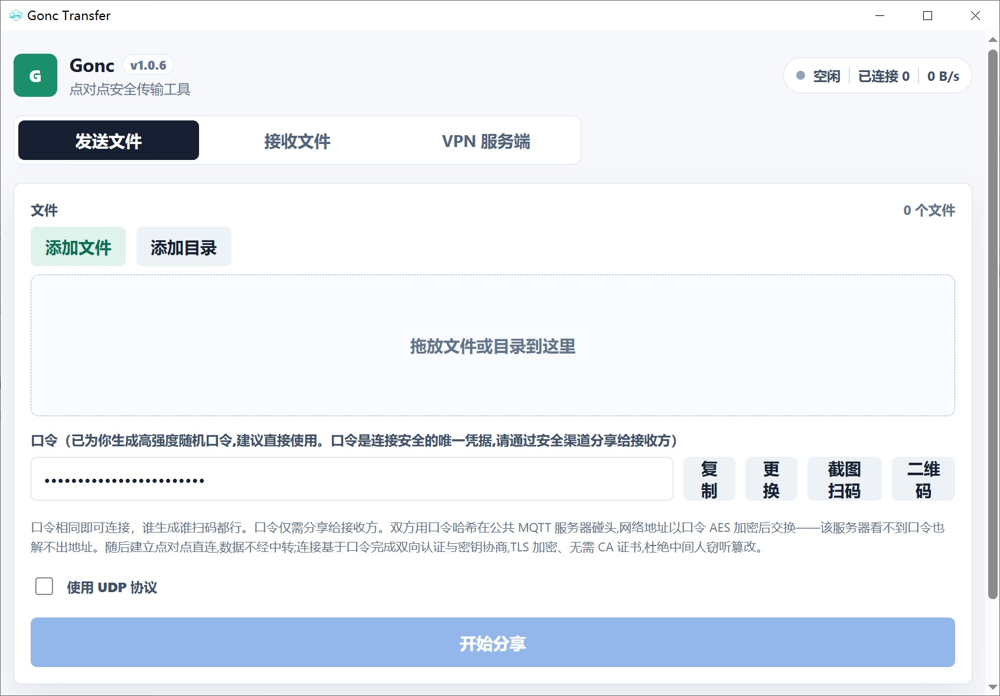
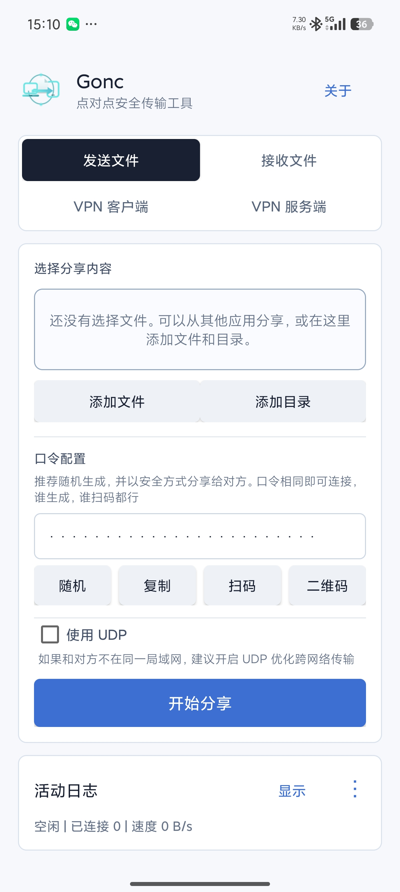
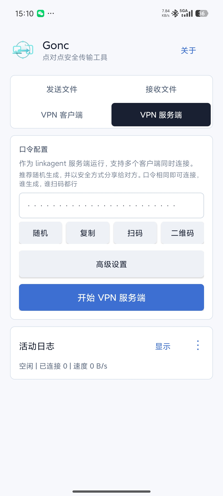

# gonc-gui

Desktop and Android UI for `gonc` point-to-point secure transfer.

The desktop app embeds the `gonetcat` Go engine in the Wails backend. The
Android app uses a gomobile-generated `mobilegonc.aar` built from the sibling
`gonetcat` checkout.

## Screenshots

### Desktop



### Android

<p>
  
  
</p>

## Layout

```text
gonc-gui/
  app.go                    Wails backend methods exposed to the frontend
  internal/goncrunner/      embedded gonc session runner
  frontend/                 React UI
  android/                  Android preview app shell
  scripts/                  helper scripts
  android/update-mobilegonc-aar.bat rebuild Android mobilegonc.aar from ../gonetcat
```

## Desktop Development

Install dependencies:

```powershell
npm install --prefix frontend
```

Run in development mode:

```powershell
$env:GOPROXY="https://goproxy.cn,direct"
wails dev
```

Build:

```powershell
$env:GOPROXY="https://goproxy.cn,direct"
wails build
```

## Android Development

The Android project lives in `android/`.

Build debug APK:

```powershell
cd android
.\gradlew.bat assembleDebug
```

Or double-click:

```text
android\build-debug-apk.bat
```

Build release APK:

```text
android\build-release-apk.bat
```

Release builds require `android\keystore.properties`; unsigned release APKs are
blocked. The signed output is:

```text
android\app\build\outputs\apk\release\app-release.apk
```

After changing the Go mobile bridge in `..\gonetcat\mobilegonc`, rebuild the AAR
from the repository root:

```text
android\update-mobilegonc-aar.bat
```

The script uses relative paths:

- Go source: `..\gonetcat\mobilegonc`
- AAR output: `android\app\libs\mobilegonc.aar`
- Strip helper: `android\scripts\strip-mobilegonc-aar.ps1`

`ANDROID_HOME` and `ANDROID_SDK_ROOT` are only defaulted by the script when they
are not already set.

## First supported flow

Sender:

```text
gonc -p2p <passphrase> -httpserver <file-or-folder>...
```

Receiver:

```text
gonc -p2p <passphrase> -download <save-dir>
```
