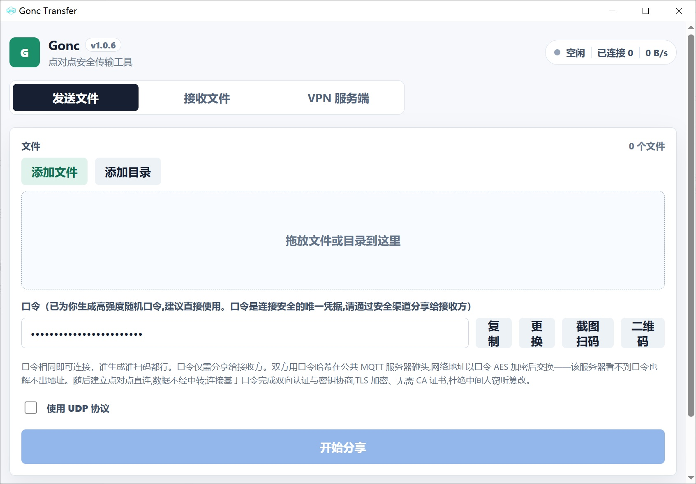
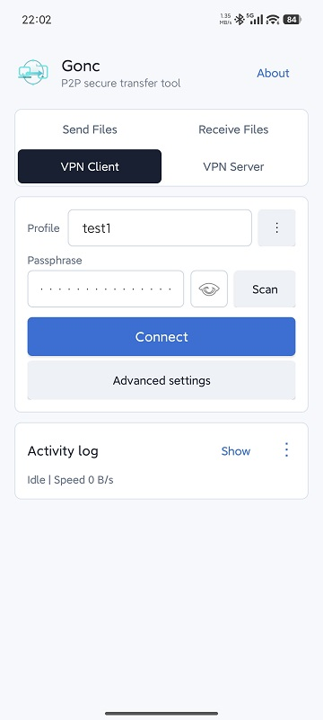
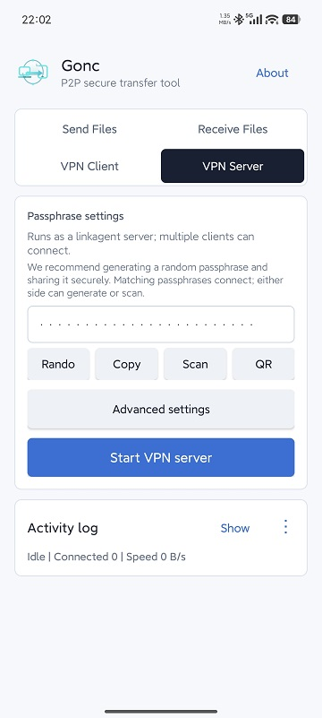

# Gonc

Point-to-point secure file transfer and VPN tunneling for desktop and Android.

Gonc helps two devices find each other with a shared passphrase, then transfers
files directly whenever the network allows it. No account, no cloud upload, no
file size gate. It also includes a VPN mode for building an encrypted tunnel
between your own devices.



<p>
  
  
</p>

## Features

- **Send files and folders directly** - Share multiple files or whole
  directories between desktop and Android.
- **No accounts** - A shared passphrase is enough to connect both sides.
- **End-to-end encrypted** - The passphrase is used for mutual authentication
  and encrypted connection setup.
- **True P2P when connected** - A successful transfer uses a real peer-to-peer
  connection. Gonc does not provide an official relay service by default.
- **Reliable receive mode** - Browse the remote file list, download everything
  or selected paths, and resume interrupted downloads with BLAKE3 block repair.
- **Android and desktop UI** - The same workflow is available on Windows and
  Android.
- **VPN tunnel** - Run a VPN server on one side and connect from another device
  with saved profiles and QR import/export.
- **IPv4 and IPv6 aware** - VPN mode supports IPv6 routing checks and DNS leak
  protection options on Windows.

## Download

Download the latest build from
[GitHub Releases](https://github.com/threatexpert/gonc-gui/releases).

Release packages are named like:

| Platform | Package |
| --- | --- |
| Windows x64 | `gonc-gui-<version>-windows-amd64.zip` |
| Windows arm64 | `gonc-gui-<version>-windows-arm64.zip` |
| Android arm64 | `gonc-gui-<version>-android-arm64.apk` |

On Windows, keep `gonc-gui.exe` and `wintun.dll` in the same folder when using
VPN features.

## How It Works

1. The sender chooses files or folders and starts sharing.
2. Gonc generates or accepts a passphrase.
3. The receiver enters or scans the same passphrase.
4. Both sides exchange encrypted connection information over public MQTT
   signaling servers.
5. Gonc tries NAT traversal and starts the transfer after a real P2P connection
   is established.

The signaling server is only used to help both peers meet. It cannot see the
passphrase and cannot decrypt the exchanged network information.

If both peers are behind restrictive IPv4 NATs, NAT traversal may fail. In that
case, use a SOCKS5 proxy server as a relay path.

## Send Files

1. Open **Send Files**.
2. Add files or folders.
3. Use the generated passphrase, or enter your own strong passphrase.
4. Share the passphrase or QR code with the receiver through a trusted channel.
5. Keep the sender running until the receiver finishes.

## Receive Files

1. Open **Receive Files**.
2. Enter or scan the sender passphrase.
3. Choose the save folder.
4. Connect, browse the remote directory, then download selected files or the
   current folder.

Resume mode validates local blocks with a BLAKE3 manifest before reusing them.
For interrupted downloads, Gonc resumes from the last verified complete block
instead of blindly trusting the local file size.

## VPN Tunnel

Gonc can also run a VPN tunnel between devices:

- **VPN Server** runs a `linkagent` endpoint and can expose this device as the
  traffic exit.
- **VPN Client** connects to the server and can start a system VPN interface.
- Profiles can be saved and shared by QR code.
- Advanced options include DNS servers, route CIDRs, MTU, route metric, upstream
  proxy, tunnel-only mode, and extra `gonc` arguments.

On Windows, VPN client mode may request administrator permission so it can
configure routes and DNS protection.

## Privacy And Security

- Gonc does not require user accounts.
- Files are not uploaded to cloud storage by the GUI.
- The shared passphrase is the connection secret; share it through a trusted
  channel.
- P2P connection metadata is encrypted before being sent through signaling.
- File repair uses BLAKE3 block hashes to avoid trusting stale local data.

## Troubleshooting

### Windows App Does Not Open

Gonc uses Microsoft Edge WebView2 through Wails. If the app does not open,
install or repair the
[Microsoft Edge WebView2 Runtime](https://developer.microsoft.com/microsoft-edge/webview2/).

### Android VPN Stops In The Background

Android may restrict long-running background work. Allow Gonc to ignore battery
optimization or set the app battery mode to unrestricted.

### Transfer Cannot Connect

- Make sure both sides use the exact same passphrase.
- If both sides are behind NAT4 networks, configure a SOCKS5 proxy server as a
  relay.


## Development

The desktop app is built with Wails and embeds the `gonetcat` Go engine. The
Android app uses a gomobile-generated `mobilegonc.aar` built from the sibling
`gonetcat` checkout.


Rebuild the Android Go bridge after changing `..\gonetcat`:

```text
android\update-mobilegonc-aar.bat
```

Create release packages:

```text
release.bat
```

## Project Layout

```text
gonc-gui/
  app.go                    Wails backend methods exposed to the frontend
  frontend/                 Desktop React UI
  internal/goncrunner/      Embedded gonc session runner
  internal/httpdownload/    Desktop HTTP receive downloader
  android/                  Android app
  android/update-mobilegonc-aar.bat
                            Rebuild Android mobilegonc.aar from ../gonetcat
```

## License

See [LICENSE](LICENSE).
