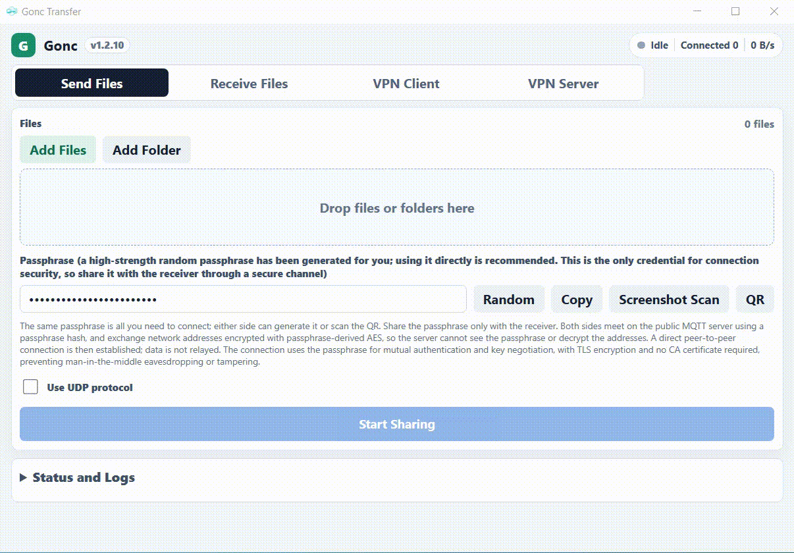

# Gonc

面向桌面端和 Android 的点对点安全文件传输与远程组网工具。

Gonc 通过共享口令帮助两台设备找到彼此，在相同内网可快速发现彼此并直接
内网直连，不同网络则通过 NAT 穿透和打洞建立点对点直连。不需要账号，不
上传到云端，也没有文件大小限制。Gonc 还
包含远程组网模式，可在外面轻松地和家里网络或公司网络直连组网。不用
服务器，不用账号，设备之间直接建立加密连接。



<p>
  
  
</p>

## 功能特性

- **直接发送文件和文件夹** - 在桌面端和 Android 之间共享多个文件或整个
  目录。
- **无需账号** - 双方使用同一个共享口令即可连接。
- **端到端加密** - 流量受 TLS 1.3 保护。TLS 证书会从共享口令自动派生，
  并强制双向认证，因此不需要 CA 证书，也能防止中间人窃听或篡改。
- **连接成功后是真正的 P2P** - 成功传输时使用真实的点对点连接。Gonc
  默认不提供官方中继服务。
- **可靠的接收模式** - 可浏览远端文件列表，下载全部或指定路径，并通过
  BLAKE3 分块修复恢复中断下载。
- **Android 和桌面端界面** - Windows 和 Android 使用同一套工作流。
- **轻松远程组网** - 在多种设备架构上运行
  `gonc -p2p <passphrase> -linkagent`，即可从桌面端或 Android 客户端
  远程连接家里或公司的网络。
- **支持 IPv4 和 IPv6 场景** - 远程组网模式在 Windows 上支持 IPv6 路由检查和
  DNS 泄漏保护选项。

## 下载

从 [GitHub Releases](https://github.com/threatexpert/gonc-gui/releases)
下载最新版本。

发布包命名类似：

| 平台 | 包名 |
| --- | --- |
| Windows x64 | `gonc-gui-<version>-windows-amd64.zip` |
| Windows arm64 | `gonc-gui-<version>-windows-arm64.zip` |
| Android arm64 | `gonc-gui-<version>-android-arm64.apk` |

在 Windows 上使用远程组网功能时，请将 `gonc-gui.exe` 和 `wintun.dll` 放在同一
目录。

## 工作原理

1. 发送方选择文件或文件夹并开始共享。
2. Gonc 生成或接受一个共享口令。
3. 接收方输入或扫描同一个共享口令。
4. 双方通过公共 MQTT 信令服务器交换加密后的连接信息。
5. Gonc 尝试 NAT 穿透，并在建立真实 P2P 连接后开始传输。

信令服务器只用于帮助双方相遇。它无法看到共享口令，也无法解密交换的网络
信息。

如果双方都位于限制较强的 IPv4 NAT 后面，NAT 穿透可能失败。这种情况下可
以使用 SOCKS5 代理服务器作为中继路径。

### NAT 穿透支持情况

如果双方都有 IPv6 连接能力，通常是最容易建立直连的情况。

对于 IPv4，NAT 穿透表现取决于双方各自的 NAT 类型：

| 类型 | NAT 类型 | P2P 穿透难度 |
| --- | --- | --- |
| 1 | Full Cone NAT，完全锥形 NAT | 最容易 |
| 2 | Restricted Cone NAT，地址受限锥形 NAT | 容易 |
| 3 | Port Restricted Cone NAT，端口受限锥形 NAT | 中等 |
| 4 | Symmetric NAT，对称型 NAT | 最难 |

Gonc 预期的 IPv4 穿透能力如下：

| A 端 NAT | B 端 NAT | 预期结果 |
| --- | --- | --- |
| 类型 1 | 类型 1、2、3 或 4 | TCP 和 UDP 可用 |
| 类型 2 | 类型 2、3 或 4 | TCP 和 UDP 可用 |
| 类型 3 | 类型 3 或 4 | UDP 可用 |
| 类型 4 | 类型 4 | 无法直接连接；需要用户自备支持 UDP ASSOCIATE 的 SOCKS5 代理服务器作为中继路径 |

## 发送文件

1. 打开 **Send Files**。
2. 添加文件或文件夹。
3. 使用生成的口令，或输入你自己的强口令。
4. 通过可信渠道将口令或二维码分享给接收方。
5. 保持发送方运行，直到接收方完成下载。

## 接收文件

1. 打开 **Receive Files**。
2. 输入或扫描发送方口令。
3. 选择保存目录。
4. 连接后浏览远端目录，然后下载选中的文件或当前文件夹。

断点续传模式会使用 BLAKE3 清单校验本地分块，再决定是否复用。对于中断的
下载，Gonc 会从最后一个校验通过的完整分块继续，而不是盲目信任本地文件
大小。

收到的文件存在、可读、是常规文件，并且大小与当前远端列表一致时，接收列表
会将它标记为本地可用。这只是便捷性检查，不代表内容完整性验证。桌面端的
“定位”按钮只会在资源管理器、Finder 或当前平台的文件管理器中显示文件；
Gonc 桌面端不会直接打开收到的文件。

Android 端可在当前接收会话中打开、选择其他应用打开、分享或查看本地可用
文件的信息；这些动作不会作为下载历史跨应用启动保存。打开 APK 时，Gonc
只会将文件交给 Android 系统软件包安装器，由系统处理未知来源授权和安装
确认；Gonc 不会静默安装软件包。

## 远程组网

Gonc 也可以在设备之间建立加密组网隧道。人在外面时，可以轻松和家里网络或
公司网络直连组网；不需要自建中心服务器，不需要账号，双方通过共享口令和
P2P 穿透建立连接。服务端部署方式很简单：在家里、公司或远端设备上运行：

```text
gonc -p2p <passphrase> -linkagent
```

然后从桌面端或 Android 客户端连接它。

- **组网服务端** 运行 `linkagent` 端点，并可将这台设备作为流量出口。
- **组网客户端** 连接到服务端，并可启动系统网络接口。
- 配置可保存，也可通过二维码分享。
- 高级选项包括 DNS 服务器、路由 CIDR、MTU、路由 metric、上游代理、
  仅隧道模式，以及额外的 `gonc` 参数。

在 Windows 上，组网客户端模式可能会请求管理员权限，以便配置路由和 DNS
保护。

## 隐私与安全

- Gonc 不需要用户账号。
- 文件数据只会在 TLS 1.3 安全连接建立后传输。即使使用 SOCKS5 服务器作为
  中继路径，它也只能看到 TLS 加密后的流量，无法读取或篡改文件内容。
- 共享口令就是连接密钥。任何拥有口令的人都可以连接并接收你共享的文件，
  因此请每次使用随机生成的高强度口令，不要复用已经分享过的口令。
- Gonc 从口令派生 TLS 证书并要求双向认证，因此不需要 CA 证书。
- Gonc 使用公共第三方 STUN 服务器发现 NAT 地址，并使用公共 MQTT 服务器
  进行信令。双方会使用从口令派生的哈希在 MQTT 上相遇，网络地址则使用从
  口令派生的数据通过 AES-GCM 加密后交换。MQTT 服务器无法看到口令，也
  无法解密交换的地址。
- 文件修复使用 BLAKE3 分块哈希，避免信任过期的本地数据。

用于 STUN 和信令的公共服务器：

```text
STUN:
tcp://turn.cloudflare.com:80
udp://turn.cloudflare.com:53
udp://stun.l.google.com:19302
stun.gonc.cc:3478
global.turn.twilio.com:3478
stun.nextcloud.com:443

MQTT:
tcp://broker.hivemq.com:1883
tcp://broker.emqx.io:1883
tcp://test.mosquitto.org:1883
tcp://mqtt.gonc.cc:1883
```

## 故障排查

### Windows 应用无法打开

Gonc 通过 Wails 使用 Microsoft Edge WebView2。如果应用无法打开，请安装或
修复
[Microsoft Edge WebView2 Runtime](https://developer.microsoft.com/microsoft-edge/webview2/)。

### Android 组网连接在后台停止

Android 可能会限制长时间运行的后台任务。请允许 Gonc 忽略电池优化，或将
应用电池模式设置为不受限制。

### 无法连接传输

- 确认双方使用完全相同的口令。
- 如果双方都位于类型 4 / 对称型 NAT 后面，请配置你自己的、支持
  UDP ASSOCIATE 的 SOCKS5 代理服务器，让 Gonc 将其作为中继路径。

## 开发

桌面端应用使用 Wails 构建，并嵌入 `gonetcat` Go 引擎。Android 应用使用
gomobile 生成的 `mobilegonc.aar`，它来自相邻的 `gonetcat` 仓库。

修改 `..\gonetcat` 后，重新构建 Android Go bridge：

```text
android\update-mobilegonc-aar.bat
```

创建发布包：

```text
release.bat
```

## 项目结构

```text
gonc-gui/
  app.go                    Wails 后端方法，暴露给前端
  frontend/                 桌面端 React UI
  internal/goncrunner/      内嵌的 gonc 会话运行器
  internal/httpdownload/    桌面端 HTTP 接收下载器
  android/                  Android 应用
  android/update-mobilegonc-aar.bat
                            从 ../gonetcat 重建 Android mobilegonc.aar
```

## 许可证

参见 [LICENSE](LICENSE)。
